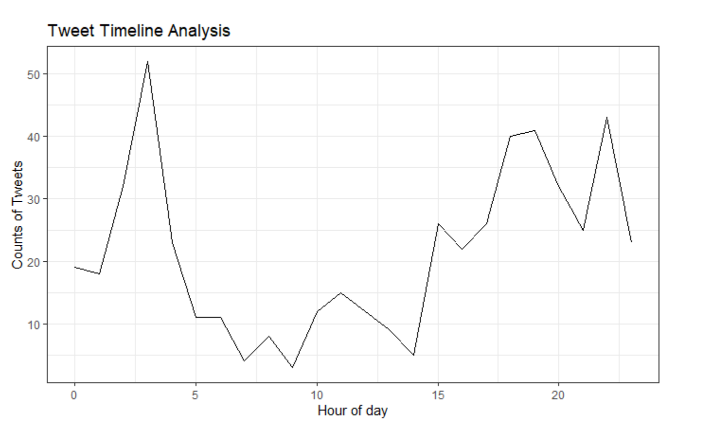
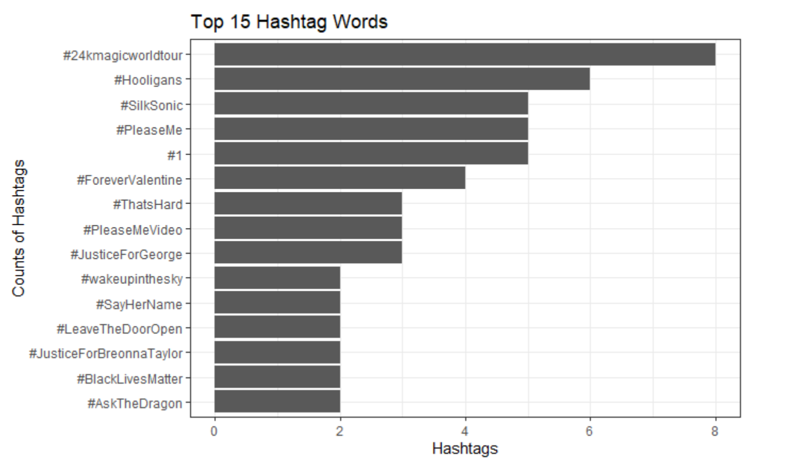

```{r, include = FALSE}
knitr::opts_chunk$set(
  collapse = TRUE,
  comment = "#>"
)
```

## Introduction to tweetr

`tweetr` is a R package for text analysis and sentiment analysis on
tweets. The package will allow you to extract tweets from Twitter,
visualize user habit on tweet posting, and apply sentiment analysis to
the data.

To use this package, follow the installation guide on README and 
install this package.  Then, import the package.

```{r setup}
library(tweetr)
```

## Functions

-   Download tweet data with `get_tweets`:       
    -   This function extracts tweets from a Twitter user given their
        handle (i.e. @elonmusk).
    -   Note that this function requires Twitter API credentials. Users 
        need to store their credentials in a `.Renviron` file in the 
        root directory. 

    ```{r 1.1, eval=FALSE}
      data <- get_tweets('@BrunoMars', n_tweets=100)
      
    ```
    -   We generated a tweet data for test purpose. Once you install 
        `tweetr` package, you have install the test data, which contains 
        500 tweets from @BrunoMars. You can use the data by 
        `tweetr::brunomars_tweet`.
    
-   Timeline analysis with `plot_timeline`:
    -   This function creates an analysis of what time of day the tweets
        occurs and plots the counts of tweets and hours.
    
    ```{r 1.2, eval=FALSE}
    data <- tweetr::brunomars_tweet
    plot_timeline(data, time)
    ```
    {width=80%}
        
-   `plot_hashtags`:
    -   This function creates an analysis of the hashtags in tweets, and
        plots the most frequent hashtag words.
    ```{r 1.3, eval=FALSE}
    data <- tweetr::brunomars_tweet
    plot_hashtags(data)
    ```
    {width=80%}

-   `sentiment_analysis`:
    -   This function applies sentiment analysis to tweets. It
        associates tokens in tweets with positive or negative sentiments
        and calculates their corresponding frequencies.
    ```{r 1.4, eval=FALSE}
    data <- tweetr::brunomars_tweet
    sentiment <- sentiment_analysis(data)
    ```

-   `visualize_sentiment`:
    -   This function takes in the output of sentiment\_analysis
        function and creates a visualization of user’s tweets with
        sentimental analysis.
    ```{r 1.5, eval=FALSE}
    data <- tweetr::brunomars_tweet
    sentiment <- sentiment_analysis(data)
    visualize_sentiments(sentiment)
    ```


